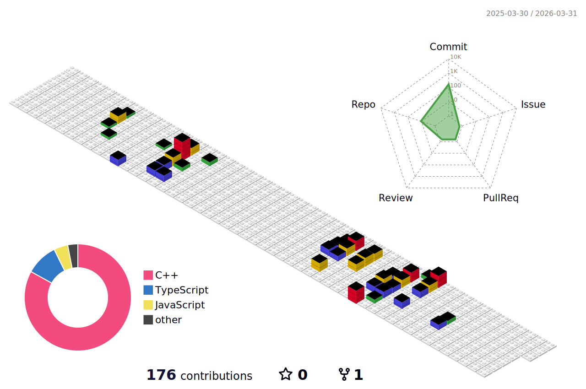

### Hi there, I'm Yash Jain 👋

I'm a Software Engineer at Excollo building production AI systems that solve real-world problems in healthcare and finance.

My approach: Ship fast, test thoroughly (82%+ coverage), measure everything, and optimize relentlessly. I work across the full stack—Python/FastAPI and Node.js/TypeScript on the backend, React/Next.js on the frontend—with a focus on Clean Architecture (DDD), event-driven systems, and building systems that maintain 99.9% uptime at scale.

---

### 🔭 What I'm Building

* **Healthcare AI:** A clinical workflow automation layer that **reduced physician documentation time by 70%** (12 min → 3.5 min), processing 8,000+ patient encounters with HIPAA-compliant infrastructure.
* **Financial Document Intelligence:** A multi-agent RAG pipeline that **cut analyst due diligence from 40+ hours to <5 minutes**, achieving 95%+ task accuracy on complex financial documents.
* **Multi-Tenant SaaS:** High-performance SaaS platforms serving 100+ concurrent workspaces with **sub-200ms API latency** and enterprise-grade security.

---

### 📫 Connect With Me

  
  
  

---

### 💻 My Tech Stack

  <strong>Languages:</strong> 
  
  
  
  
  

  <strong>AI/ML & LLMs:</strong> 
  
  
  
  
  

  <strong>Backend:</strong> 
  
  
  
  

  <strong>Frontend:</strong> 
  
  
  
  
  

  <strong>Databases:</strong> 
  
  
  
  

  <strong>Cloud, DevOps & Testing:</strong> 
  
  
  
  
  
  
  

---

### 🌟 Featured Projects

<table>
  <tr>
    <td width="50%">
      <h3 align="center">AI Persona SaaS</h3>
      

        

      

        Multi-tenant chat with OAuth 2.0 + RBAC; features a circuit breaker, n8n orchestration, Redis rate limiting, and 70% test coverage.
          
        <strong>Tech:</strong> React, TypeScript, Node.js, PostgreSQL, Prisma, OpenAI
          
        
        
      

    </td>
    <td width="50%">
      <h3 align="center">Notion Clone</h3>
      

        

      

        A real-time, collaborative note-taking application inspired by Notion, built with a modern stack.
          
        <strong>Tech:</strong> React, TypeScript, Next.js, Tailwind CSS
          
        
        
      

    </td>
  </tr>
  <tr>
    <td width="50%">
      <h3 align="center">E-Commerce Website</h3>
      

        

      

        A full-stack e-commerce platform featuring product listings, a shopping cart, and a complete checkout process.
          
        <strong>Tech:</strong> React, Node.js, Express, MongoDB
          
        
        
      

    </td>
    <td width="50%">
      <h3 align="center">Finance App</h3>
      

        

      

        A personal finance dashboard for tracking income, expenses, and budgets.
          
        <strong>Tech:</strong> React, Node.js, TypeScript, PostgreSQL
          
        
        
      

    </td>
  </tr>
</table>

---

### 📊 GitHub Stats & 3D Contributions

  

  
  

